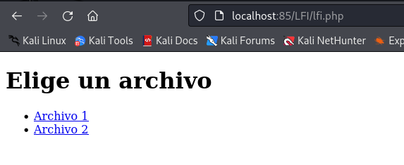
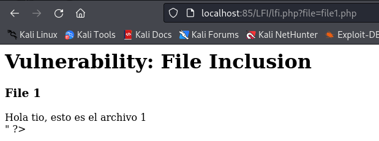
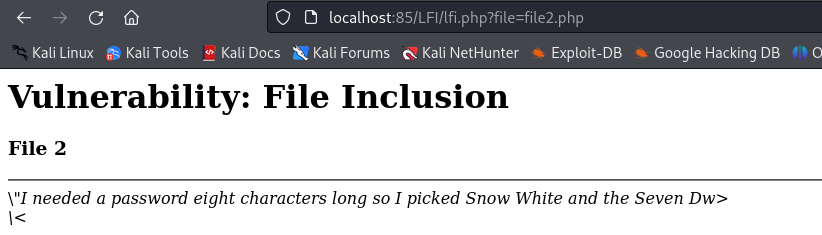
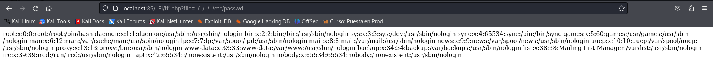

# Explotación y mitigación de LFI

## Indice

> 1. [Explotación LFI](#)  
> 	1.1 [Ejecutar código PHP (PHP Wrappers)](#)  
> 2. [Mitigación de LFI]()  
> 	2.1 [Usar una Lista Blanca de Archivos Permitidos]()  
> 	2.2 [Bloquear Secuencias de Directorios (../)]()  
> 	2.3 [Uso de realpath() para Evitar Path Traversal]()  

-----

## Explotación LFI

Creamos un fichero [lfi.php](./Recursos/lfi.php) que nos permite hacer click en dos elementos que nos llevan a los ficheros: [file1.php](./Recursos/file1.php) y [file2.php](./Recursos/file2.php):







Si nos damos cuenta, en la url aparece **file1.php** pasado como parámetro, pero podemos probar a meter la ruta de otro archivo para averiguar si es vulnerable a ***LFI***:

```
http://localhost:85/LFI/lfi.php?file=../../../../etc/passwd
```

Si lo introducimos aparece el contenido de */etc/passwd*, con lo cual ya sabemos que es vulnerable:



### Ejecutar código PHP (PHP Wrappers)


## Mitigación de LFI


### Usar una Lista Blanca de Archivos Permitidos


### Bloquear Secuencias de Directorios (../)


### Uso de realpath() para Evitar Path Traversal
