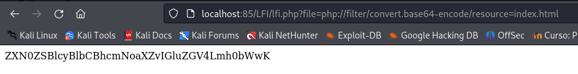
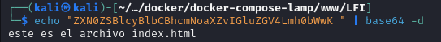
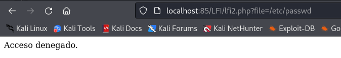
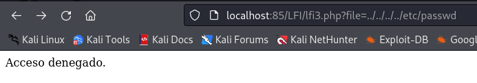

# Explotación y mitigación de LFI

## Indice

> 1. [Explotación LFI](#explotación-lfi)  
> 	1.1 [Ejecutar código PHP (PHP Wrappers)](#ejecutar-código-php-php-wrappers)  
>	1.2 [Envenenamiento de logs](#envenenamiento-de-logs)  
> 2. [Mitigación de LFI](#mitigación-de-lfi)  
> 	2.1 [Usar una Lista Blanca de Archivos Permitidos](#usar-una-lista-blanca-de-archivos-permitidos)  
> 	2.2 [Bloquear Secuencias de Directorios (../)](#bloquear-secuencias-de-directorios-)  
> 	2.3 [Uso de realpath() para Evitar Path Traversal](#uso-de-realpath-para-evitar-path-traversal)  

-----

## Explotación LFI

Creamos un fichero [lfi.php](./Recursos/lfi.php) que nos permite hacer click en dos elementos que nos llevan a los ficheros: [file1.php](./Recursos/file1.php) y [file2.php](./Recursos/file2.php):


Si nos damos cuenta, en la url aparece **file1.php** pasado como parámetro, pero podemos probar a meter la ruta de otro archivo para averiguar si es vulnerable a ***LFI***:

```
http://localhost:85/LFI/lfi.php?file=../../../../etc/passwd
```

Si lo introducimos aparece el contenido de */etc/passwd*, con lo cual ya sabemos que es vulnerable:


### Ejecutar código PHP (PHP Wrappers)

Vamos a extraer el código fuente del archivo *index.html* del servidor:



Obtenemos una cadena en base 64, la copiamos y la decodificamos con el siguiente comando:



Ya hemos obtenido el contenido del index.html.

### Envenenamiento de logs

Podemos ejecutar lo siguiente:

```
curl -A "<?php system('whoami'); ?>" http://localhost:85
```
Con esto, ejecutamos el código php para solicitar el usuario que está ejecutando el servidor de localhost. El resultado de la información "whoami" irá a los logs de apache2.

Ahora hacemos un LFI para Incluir el log, y así poder recuperar el resultado del comando ejecutado:


El usuario que esta ejecutando el servidor es *www-data*.


## Mitigación de LFI


### Usar una Lista Blanca de Archivos Permitidos

Una posible mitigación es crear una lista blanca indicando que archivos queremos que sean incluidos, todos los demos no serán incluidos.

Creamos un fichero [lfi2.php](./Recursos/lfi2.php) que solo admita los fichero de **file1.php** y **file2.php** y si intentamos incluir cualquier otro no nos dejará:



### Bloquear Secuencias de Directorios (../)

Con *str_contains* verificamos si el nombre del archivo contiene ".." y denegaríamos el acceso.

[lfi3.php](./Recursos/lfi3.php)



### Uso de realpath() para Evitar Path Traversal

De esta forma garantizamos que no haya una ruta transversal para llevarnos a una ruta diferente de donde están ubicados los directorios.

[lfi4.php](./Recursos/lfi4.php)

- Asi verificamos de directorios están en el mismo directorio que lfi.php
- También comprobamos que el archivo existe.
- Garantiza que el archivo esté en el direcotorio indicado: $baseDir

🔒 Medidas de seguridad implementadas

    Lista blanca de archivos permitidos ($archivos_permitidos):

        Solo permite los archivos explícitamente definidos en la lista.

        Un atacante no puede solicitar otros archivos del servidor.

    Usa realpath() y str_starts_with() para evitar rutas maliciosas:
        Evita ../ y rutas fuera del directorio permitido.

    Escapa el contenido del archivo antes de mostrarlo (htmlspecialchars()):

        Evita ataques XSS si el archivo contiene código HTML.

        nl2br() mantiene los saltos de línea.

🚀 Resultado

✔ Solo permite file1.php y file2.php.

✔ Bloquea cualquier intento de LFI o acceso no autorizado.

✔ Evita XSS mostrando contenido de forma segura.
